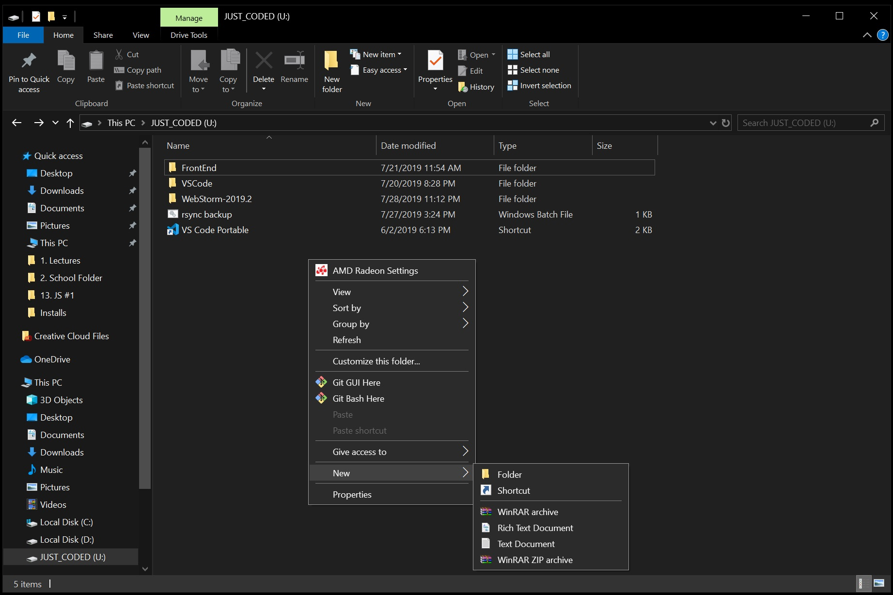

# 1. Скачать последнюю версию WebStorm

https://www.jetbrains.com/webstorm/download

# 2. Распакуйте дистрибутив при помощи архиватора 7zip

https://www.7-zip.org/


# 3. Заходим в полученную папку с программой

* Удалите папку **./$PLUGINDIR**

> она бесполезна

*  Откройте файл конфигурации **./bin/idea.properties** с помощью Notepad и измените пути хранения настроек cо стандартных:

```
# idea.config.path=${user.home}/.WebStorm/config

# idea.system.path=${user.home}/.WebStorm/system
```


на слудующие:

```
idea.config.path=${idea.home}/config

idea.system.path=${idea.home}/system
```
> не забудьте раскомментировать эти строки (убрать # в начале строки)


# 4. Переносим настройки и плагины с ПК версии программы на портативную

* Заходим в копьютере на котором утановлен WebStorm в следующую директорию
```
C:\Users\<USER ACCOUNT NAME>\.<PRODUCT><VERSION>
```

> <USER ACCOUNT NAME> - имя пользователя ПК
> .<PRODUCT><VERSION> - папка WebStorm'а с пользовательскими настройками. С каждой новой версией её имя меняется. На момент написания данной инструкции папка именуется как .WebStorm2019.2


* Копируем папки **config** и **system** в портативную версиею программы 
```
U:\WebStorm-2019.2
```


> Теперь все готово для копирования папки с программой на флешку

# 5. Копируем папку с программой на флешку

* Чтобы запустить WebStorm нужно запустить файл **webstorm64.exe**, либо **webstorm.exe** (если у вас установлена 32-битая ОС), которые находятся в папке **bin**:


# 6. Создаем ярлык для запуска WebStorm в корне флешки для простоты запуска портативной программы

> С помощью данного ярлыка вы сможете запускать WebStorm не смотря на то, какое имя диска будет дано вашему флешнакопителю при подключении к ПК

* Заходим в проводнике Windows в то место, где мы хотим создать наш ярлык и вызываем мастер создания ярлыков

> Нажимаем правой кнопкой миши по пустой области в проводнике выбираем пункт 'Cоздать' и 'Ярлык'



* В открывшемся диалоговом окне, в строке 'Укажите расположение объекта' вводим:

```
%windir%\system32\cmd.exe /C start /B /D \WebStorm-2019.2 \WebStorm-2019.2\bin\webstorm64.exe
```

> %windir%\system32\cmd.exe /C start /B /D \*путь до папки с программой* \*путь до папки с программой*\*название файла.exe*
>если вы хотите разместить ярлыки в отдельной папке (например, в корне создали дополнительную папку), то вам нужно указать командной строке, что она должна вернуться на папку назад. Для этого перед первым слешом в пути ставим точку '.' 
> %windir%\system32\cmd.exe /C start /B /D .\*путь до папки с программой* .\*путь до папки с программой*\*название файла.exe*

* Нажимаем 'Далее' и даем имя ярлыку (любое, на ваше усмотрение):


* Нажимаем 'Готово' и у нас теперь появился ярлык для запуска WebStorm. Но это еще не все. Теперь заходим с 'Свойства' нашего ярлыка и содержимое поля 'Рабочая папка':


* Для того, чтобы при запуске не отображалось окно командной строки, в поле 'Окно' выбираем 'Свернутое в значок':


* Также здесь можем присвоить пиктограмму WebStorm'а нашему ярлыку:


# 7. Портативная версия WebStorm готова!

 

> Скачав архим с данного репозитория вы можете найти в нем уже отредактированный файл 'idea.properties', готовый ярлык и папки 'config' и 'system' с моими конфигурациями и натройками WebStorm'а